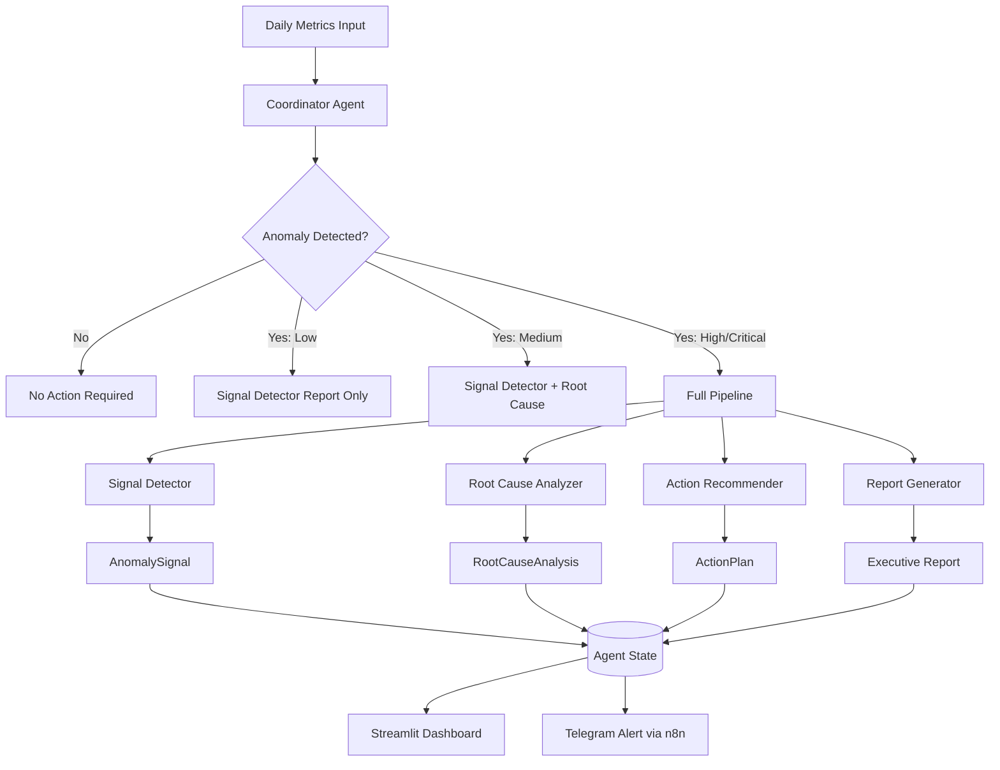
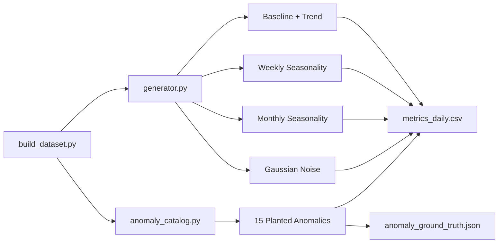
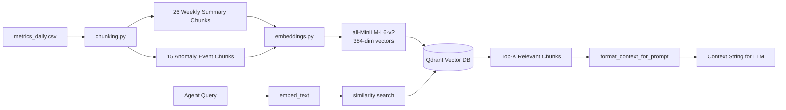
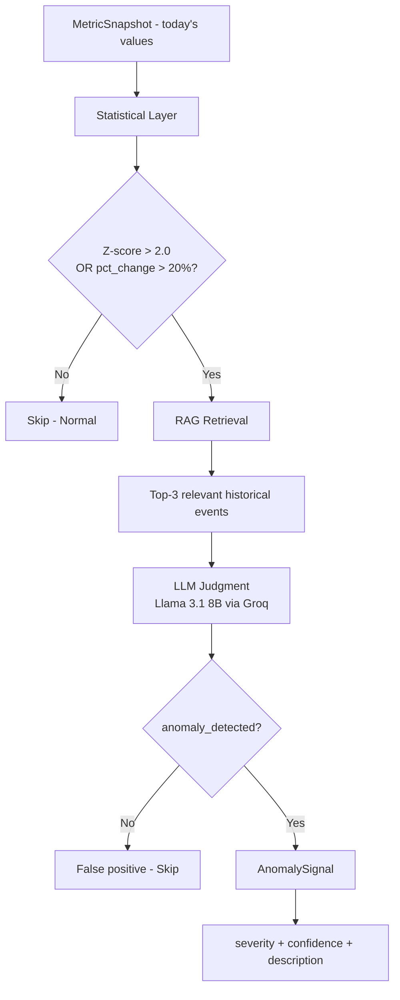
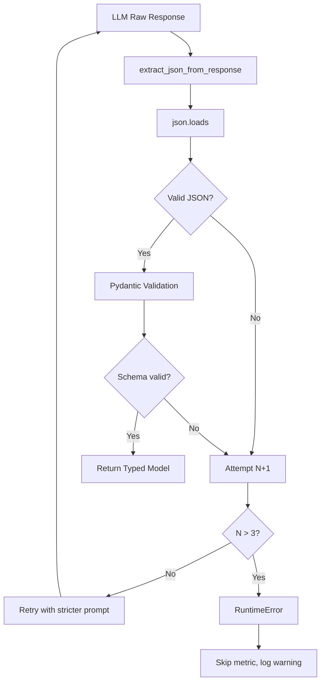

# OpsAgent — Architecture Documentation

*Last updated: Phase 1 complete*

---

## System Overview

OpsAgent is a multi-agent AI system that monitors business metrics, detects anomalies, diagnoses root causes, and recommends corrective actions.

The system is built around five specialized agents coordinated by a LangGraph state machine. Each agent has a single responsibility and communicates through a shared state object.

---

## High-Level Architecture



---

## Phase 1 Components (Current)

### 1. Data Pipeline



**Key design decision:** Synthetic data with controlled ground truth. We know exactly when and why each anomaly occurs, making Phase 3 evaluation objective rather than subjective.

The 4-layer generation approach:
```
Final Value = Baseline × Trend × Seasonality × Noise × [Anomaly Multiplier]
```

### 2. RAG Pipeline



**Chunking strategy:** Two complementary strategies —
- **Weekly summaries**: broad overview per week, good for period queries
- **Anomaly events**: focused chunks with 3-day context window around each anomaly, good for specific incident queries

### 3. Signal Detector Agent



**Hybrid detection rationale:**
- Statistical layer is fast and objective but context-blind (can't distinguish Lebaran spike from real anomaly)
- LLM layer adds contextual judgment but is slower and costs tokens
- Statistical gate ensures LLM is only called when numbers are genuinely suspicious

### 4. Output Validation & Retry



---

## Technology Decisions

### Why LangGraph over CrewAI?
LangGraph gives us explicit control over the state machine — we define exactly which agents run, in what order, and under what conditions. CrewAI is higher-level but less transparent, which hurts debuggability and observability.

### Why Groq + Llama over OpenAI?
Zero cost. Groq's free tier provides fast inference (Llama 3.3 70B, Llama 3.1 8B) with generous rate limits. For a portfolio project that needs to run 100+ evaluation cycles, $0 operational cost is non-negotiable.

### Why Qdrant over ChromaDB?
Qdrant has a proper client-server architecture (runs as a Docker service), which mirrors production deployments. ChromaDB is simpler but more "embedded library" than "production database." Qdrant also has better metadata filtering, which we use for chunk_type and severity filters.

### Why Synthetic Data?
Three reasons:
1. **Controlled ground truth**: we know exactly when and why anomalies occur, enabling objective evaluation
2. **Business universality**: revenue, churn, conversion — metrics every recruiter understands
3. **Portfolio differentiation**: building a dataset generator demonstrates deeper engineering than downloading a Kaggle CSV

### Why sentence-transformers (local) over OpenAI Embeddings?
Free, fast, and sufficient. `all-MiniLM-L6-v2` produces 384-dim vectors that capture semantic meaning well for our use case. Running locally means no API cost, no rate limits, and no latency for embedding.

---

## Data Flow (End-to-End)

```
1. Daily metrics arrive as a MetricSnapshot (6 metrics, 1 day)
2. Signal Detector checks each metric statistically
3. Suspicious metrics trigger RAG retrieval for historical context
4. LLM makes final anomaly judgment with context
5. Confirmed anomalies become AnomalySignal objects
6. [Phase 2] Coordinator routes to Root Cause, Recommender, Report Generator
7. [Phase 2] Full pipeline state stored in LangGraph AgentState
8. [Phase 3] All LLM calls traced in Langfuse
9. [Phase 4] Results displayed in Streamlit + pushed to Telegram via n8n
```

---

## Directory Structure

```
opsagent/
├── src/
│   ├── config.py              # Single source of truth for all config
│   ├── data/                  # Synthetic dataset generation
│   │   ├── generator.py       # 4-layer time series generation
│   │   ├── anomaly_catalog.py # 15 planted anomalies with ground truth
│   │   └── build_dataset.py   # Orchestrates full dataset generation
│   ├── rag/                   # Retrieval-Augmented Generation
│   │   ├── embeddings.py      # sentence-transformers wrapper
│   │   ├── vector_store.py    # Qdrant CRUD operations
│   │   ├── chunking.py        # Weekly + anomaly event chunking
│   │   └── retriever.py       # Agent-facing retrieval interface
│   └── agents/
│       ├── signal_detector.py # Agent 1: anomaly detection
│       └── output_validator.py # Retry + Pydantic validation layer
├── data/
│   ├── raw/                   # Generated dataset (gitignored)
│   └── golden_testset/        # Evaluation test cases (Phase 3)
├── tests/
│   └── test_agents.py         # 31 tests, all passing
└── docs/
    └── architecture.md        # This document
```

---

*Phase 2 will add: Root Cause Analyzer, Action Recommender, Report Generator, Coordinator, and LangGraph orchestration.*
